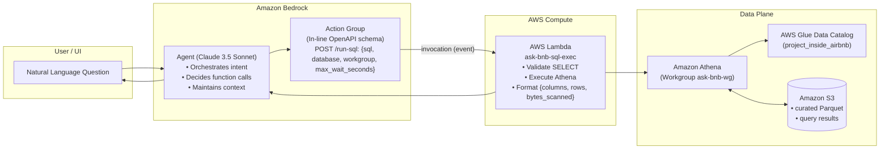

# ask-bnb
Conversational Airbnb data search powered by AWS


## Agent Architecture (Bedrock + Athena)

This document describes how the **ask-bnb** agent transforms natural language questions into **SELECT** queries in **Amazon Athena**, returning tabular data from the `project_inside_airbnb.curated_listings` table.


### Overview:
- **Amazon Bedrock Agent (Claude 3.5 Sonnet)**: interprets intent, decides to trigger Action Group functions, and maintains context.
- **Action Group**: defined with In-line OpenAPI schema (contract). Routes calls to a Lambda function.
- **AWS Lambda (`ask-bnb-sql-exec`)**: runs SELECT in Athena (DB project_inside_airbnb, WG ask-bnb-wg) and returns { columns, rows, bytes_scanned }.
- **Athena + Glue + S3**: Athena queries data in S3 using Glue metadata; results are stored in the query results bucket.


### Component Diagram



---

### Sequence Diagram

```mermaid
sequenceDiagram
    autonumber
    participant U as User/UI
    participant AGT as Bedrock Agent (Claude)
    participant AG as Action Group (OpenAPI)
    participant L as Lambda (ask-bnb-sql-exec)
    participant ATH as Athena
    participant S3 as Amazon S3
    participant GC as Glue Catalog

    U->>AGT: NL Question (e.g., “Top 5 highest-rated apartments…”) 
    AGT->>AG: Decides to invoke /run-sql with payload { sql, defaults }
    AG-->>L: Invokes Lambda (event with apiPath=/run-sql, operation=runSql)
    L->>L: Validates SELECT only and applies limits/timeouts
    L->>ATH: StartQueryExecution (DB/WG)
    ATH->>GC: Resolve metadata (curated table)
    ATH->>S3: Write query results
    L->>ATH: Poll until completion (max_wait_seconds)
    ATH-->>L: Execution complete
    L->>S3: Read tabular results
    L-->>AG: { columns, rows, bytes_scanned }
    AG-->>AGT: Pass resultset
    AGT-->>U: Response (data first; SQL and 1-line explanation)
```

---

### Key Contracts

**OpenAPI:**

The OpenAPI schema documents how the agent should invoke the function:
- Defines operations (e.g., POST `/run-sql`).
- Defines parameters (e.g., required `sql`; `database`, `workgroup`, `max_wait_seconds` with defaults).
- Defines response format (e.g., `{ columns, rows, bytes_scanned }`).
- Enables validation and helps the LLM build the correct payload before invoking Lambda.

The binding (mapping) of the Action Group points this schema to a specific Lambda; any call described in the schema is delivered as an event to this Lambda (no public HTTP).

```yaml
openapi: 3.0.1
info:
  title: ask-bnb-sql-exec
  version: '1.0'
paths:
  /run-sql:
    post:
      operationId: runSql
      description: Executes a SELECT in Amazon Athena and returns tabular rows.
      requestBody:
        required: true
        content:
          application/json:
            schema:
              type: object
              required: [sql]
              properties:
                sql:
                  type: string
                database:
                  type: string
                  default: project_inside_airbnb
                workgroup:
                  type: string
                  default: ask-bnb-wg
                max_wait_seconds:
                  type: integer
                  default: 25
      responses:
        '200':
          description: Resultset
          content:
            application/json:
              schema:
                type: object
                required: [columns, rows, bytes_scanned]
                properties:
                  columns:
                    type: array
                    items: { type: string }
                  rows:
                    type: array
                    items:
                      type: array
                      items: { type: string }
                  bytes_scanned:
                    type: integer
```

**Lambda Response:**

```json
{
  "columns": ["id", "listing_url", "review_scores_rating", "number_of_reviews", "price", "bedrooms", "bathrooms", "accommodates"],
  "rows": [["123456789", "https://www.airbnb.com/rooms/123456789", "5.0", "142", "54.0", "1", "1", "2"], ...],
  "bytes_scanned": 667584
}
```

### Responsibilities & Guardrails

**Agent (Claude):**
- Applies system prompt rules: `SELECT` only, `WHERE city = 'madrid'` when relevant, limit columns/rows, handle nulls, use `has_*` for amenities, etc.

**Action Group (OpenAPI):**
- Defines input/output contract; validates payload; guides LLM.

**Lambda:**
- Additional security/validation (reject DDL/DML; prevent multi-queries; enforce time limits; basic sanitization).
- Runs Athena query and formats output.

**Athena/Glue/S3**:
- Executes query (WG ask-bnb-wg with result location and optional KMS).